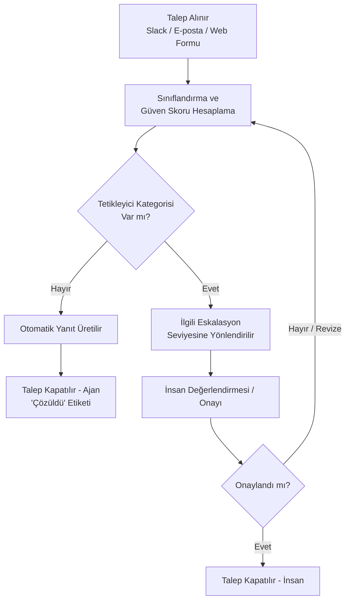

# Eskalasyon Akışı

> Bu şema, `docs/02_eskalasyon_tetikleyicileri.md` (Bölüm 5 – Karar Akışı) içeriğinin görsel karşılığıdır.

## Tetikleyici Kategorileri

- Çelişkili sinyaller
- Veri gizliliği şüphesi
- Çift yanıt riski
- Düşük güven skoru
- Hassas/hukuki içerik

## Eskalasyon Seviyeleri

| Seviye | Sorumlu |
|---|---|
| Seviye 1 | Destek Uzmanı (Tier 1) |
| Seviye 2 | Kıdemli Destek / Operasyon Sorumlusu |
| Seviye 3 | Hukuk Ekibi |
| Seviye 4 | Güvenilirlik (Reliability) Ekibi |