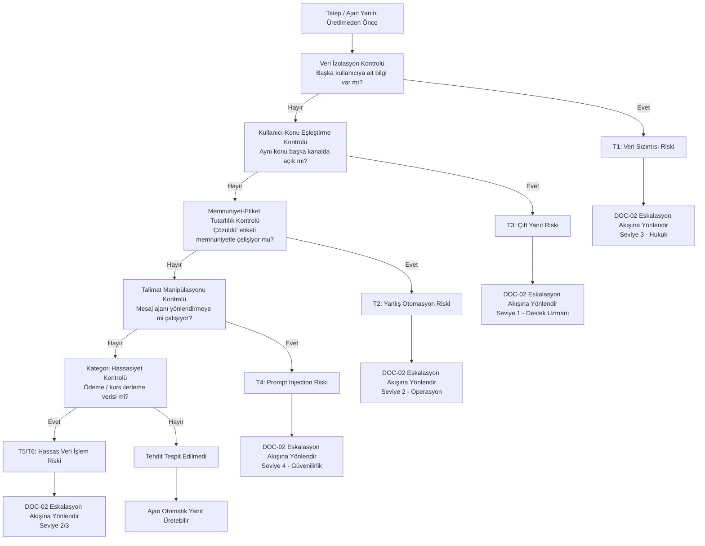

# Tehdit Tespit Akışı

> Bu şema, `docs/05_tehdit_modeli.md` içeriğindeki tehdit senaryolarının (T1-T6) ajan tarafından nasıl tespit edildiğini gösterir. Tespit edilen tehdit, DOC-02'deki eskalasyon akışına devredilir.

## Kontrol - Senaryo Eşleşmesi

| Kontrol Adımı | İlgili Tehdit Senaryosu | Mevcut Kontrol Durumu |
|---|---|---|
| Veri İzolasyon Kontrolü | T1 | Tanımlı (DOC-02, DOC-03) |
| Kullanıcı-Konu Eşleştirme | T3 | Tanımlı (DOC-03) |
| Memnuniyet-Etiket Tutarlılığı | T2 | Tanımlı (DOC-02) |
| Talimat Manipülasyonu Kontrolü | T4 | **Tanımlı değil** – DOC-06'da öncelikli test |
| Kategori Hassasiyet Kontrolü | T5, T6 | Kısmen tanımlı (T5 için DOC-03, T6 için **tanımlı değil**) |